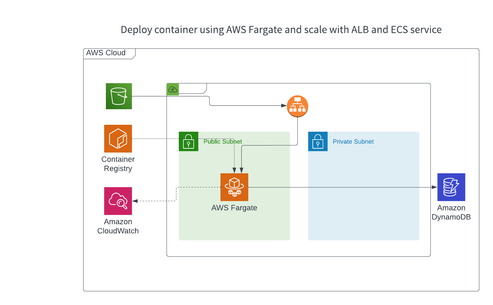

WIP
In this project, I built the adoption platform with Docker and deployed it on Amazon ECS. 

1. Terraform apply
2. Run scripts: populating ddb table, Uploading static site to S3
3. deploy the container using fargate
4.

https://erik-ekberg.medium.com/terraform-ecs-fargate-example-1397d3ab7f02

Based on [AWS Workshop](https://catalog.us-east-1.prod.workshops.aws/workshops/ed1a8610-c721-43be-b8e7-0f300f74684e/en-US/mythicalintro)
